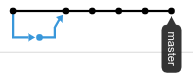

Commit History Example
======================

Shows the differences in commit histories for GitHub's different "merge button"
strategies.

## GitHub Commit History


## GitHub Network Graph



## Git Log

```
* f3520a4 Allan Reyes: docs(readme): add commit history and network graph   (rebase merge)
* cf4fc1a Allan Reyes: feat(images): add network graph
* 51f67f1 Allan Reyes: feat(images): add commit history
* 743e00c Allan Reyes: feat(git): add commitizen (#2)                       (squash merge)
*   bbece1b Allan Reyes: Merge pull request #1 from allanbreyes/yarn-init   (merge commit)
|\  
| * ab82adc Allan Reyes: feat(manifest): add package.json
|/  
* 09b4732 Allan Reyes: chore(git): initial commit
```

